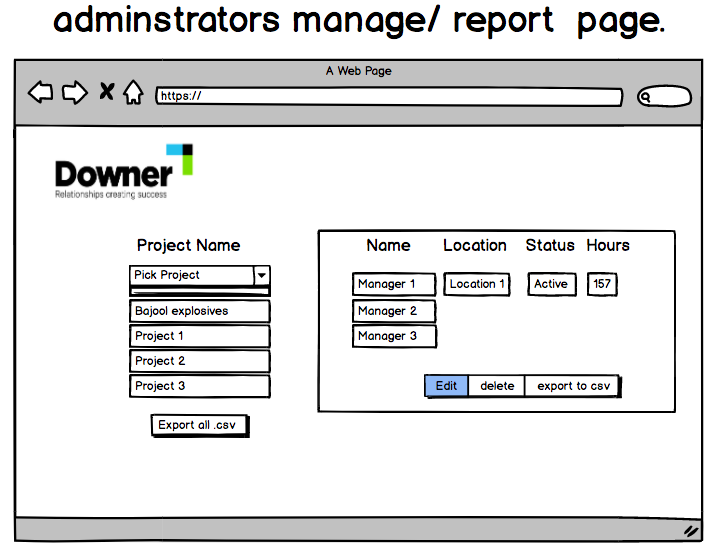
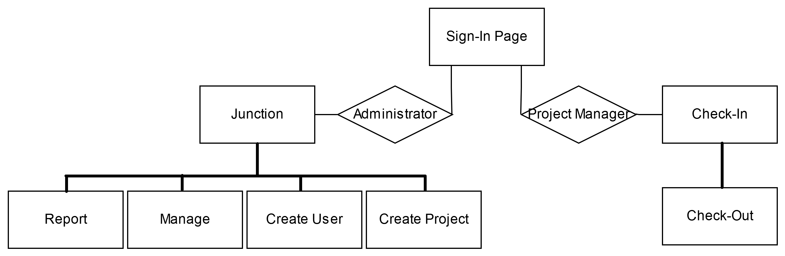

# Overview
  * Application brief
  * Wire framing and workflow diagram
  * User Stories
  * Entity relationship diagram
  * configuration steps
  * Whats needs improvement
____
### 1) Application Brief ###  
ELS is an easy to use app that allows DownerEDI employees to log hours spent on
projects mobily across their sites. ELS looks to shorten the time spent on report
generating for admins.
___
### 2) WireFraming and Workflow Diagram ###

Balsamiq was used for wireframing as we have used it on previous projects.

to see more navigate to documentation/wireframe to see the rest.
____
#### User flow ###

___
### 3) User Stories ###
### Project managers ###
  * Should be able to...
  * Sign in using my credentials so that the app knows it's me.
  * Be able to press a button to log my hours
  * Be able to pick from a dropdown what projet I am working on
  * Pick from a dropdown what kind of hours I'm working, travel, leave etc...
  * Press a button and check out of work
  * Sign out of the app
  * Leave comments for an admin about the project

### Admin ###
  * Should be able to...
  * Sign in using my credentials so that the app knows it's me
  * Create new project managers/engineers
  * To create new project numbers
  * Export the monthly data to .csv file, to merge it with ms excel
  * See a screen with all managers hours for the month
  * See a screen with all project hours for the month
  * Edit managers
  * Edit projects
  * Delete managers
  * Delete projects

### Developers ###
  * Should be able to...
  * Store databases online so that I can access it through the web
___

# Built with
  * Built using ReactJS, Node, Express and mongoDB.
  * Hosted on Netlify
___
### 4) Configuration steps

make an env file into the root of the  folder. add their secret and api url.
you can get the api from this repo 

  * Clone the repo
  * Set up a dot env file and set all these up in the route directory and place in the following environment variables
    * REACT_APP_API_URL=The-api-that-you-will-use
    * REACT_APP_JWT_SECRET=willhavetomatchtheoneinyourbackendapienv

 To set up the app to run locally in the browser.
```
npm install
```

and then

```
npm start
```

This should open up a new window in your browser otherwise
navigate to http://localhost:3000
      ___
### 5) What needs improvement ###

  - Admin can edit hours, edit and delete projects, ability to create multiple projects while staying on the same screen.

  - Manager Safeguards put in so that managers can see and edit their hours in case they either forget to checkin or check out.
